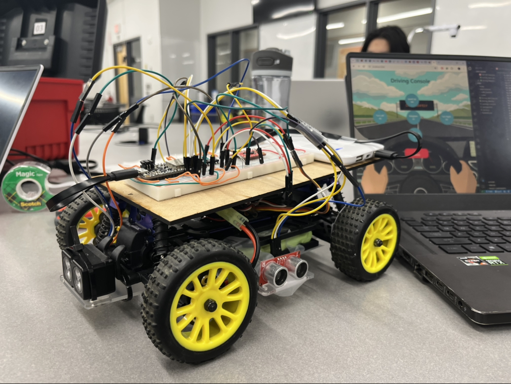

# AI Driver

Authors: Sourav Shib, Peter Zhao, Jared Solis

Date: 2024-04-23

### Summary

This repository contains all the code and documentation for the group's AI Driver quest, a smart car that is trained on a neural network to drive autonomously. The code folder contains the ESP32 code, node files, and a README detailing the specifics of the software development.

### Self-Assessment 

| Objective Criterion | Rating | Max Value  | 
|---------------------------------------------|:-----------:|:---------:|
| Objective One | 1 |  1     | 
| Objective Two | 1 |  1     | 
| Objective Three | 1 |  1     | 
| Objective Four | 1 |  1     | 
| Objective Five | 1 |  1     | 
| Objective Six | 1 |  1     | 
| Objective Seven | 1 |  1     | 

### Solution Design
Our team's solution design is a smart car equipped with Ultrasonic/LiDAR sensors with wireless and autonomous control over a fully functional Node server. Through the server, one has access to a driving console to inform the vehicle of what path to take. The ESP32 onboard the buggy constantly sends data from the front LiDAR and side ultrasonic sensors to the Node server, where it is recorded and compiled into the csv-formatted dataset. We built multiple data sets for different paths to train multiple models using Tensorflow JS corresponding to the different paths. Using this trained model, the Node server can make a prediction for buggy control and send commands for the buggy to execute, allowing for autonomous movement. The buggy also has collision detection based off of the front LiDAR sensor.

### Sketches/Diagrams

Buggy

### Investigative Question
How does the NN-based controller compares with your PID one? In practice, neural network models make small errors in test-time that gradually accumulate over time steps. As a result, the model may exhibit what is known as catastrophic failure - arriving to a part of the lane or close proximity to objects that an expert driver may have never shown during training. In these scenarios, due to the lack of suitable expert data, the AI will collide, veer off, or gets stuck. Have you observed this during your testing? Discuss an outline for an approach that can help alleviate this failure mode.

Yes, we observed this during our testing. In order to alleviate this failure, it might help to use PID as a second data point and either add it as a feature to the model or average over the two values set or have a PID override built in for when the confidence in low in the model.

### Supporting Artifacts
- [Link to Quest 5 Presentation Video](https://drive.google.com/file/d/16gQs8oE9WKBQesauEHdQyonGxzReEtN4/view?usp=sharing). Not to exceed 120s
- [Link to video demo](https://drive.google.com/file/d/1clF1g8hft9SuNDVtFyBdkgjjTOa_M1oV/view?usp=sharing). Not to exceed 120s
